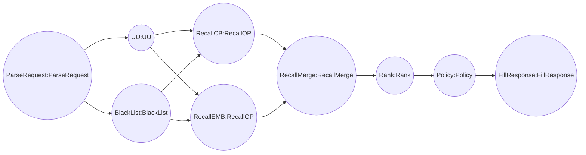
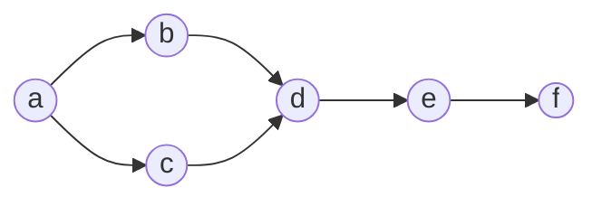

# TaskFlow

## 简介

### TaskFlow是什么？

顾名思义，TaskFlow是一堆任务的集合，按照某种特定的数据依赖，组成类似流图的关系，很多大型的任务都可以分拆为各种小型任务组成的TaskFlow。

TaskFlow有两个重要的组成方式，数据流和控制流，数据流表示数据通过输入输出，在TaskFlow的各个任务之间流动；控制流则代表TaskFlow中各个任务的执行顺序。

- **数据驱动**
  通过梳理各任务之间的数据依赖关系。优点是可以自动构建TaskFlow流图，用户不需要考虑具体的执行顺序。缺点是需要对业务进行科学精确的算子抽象。
- **流程驱动**
  用户需要自己来构造执行流程，组织串并行关系。优点是逻辑简单易理解；缺点是人工组织的执行流程存在不合理的概率较大，以及对算子的抽象能力有限。

TaskFlow的执行存在以下难点：

- 首先数据流的依赖关系需要谨慎梳理，否则容易出现数据循环依赖即流图出现成环的现象，这样的TaskFlow是无法完成的，而很多大型的任务，去判断是否存在这样的循环数据依赖非常困难。
- 在实现合理的数据依赖后，在设置控制流时，需要考虑到数据流中的各种依赖，否则，则会导致整个TaskFlow执行的崩溃。
- 流图的运行十分复杂，用户不仅需要考虑各种繁杂的数据流依赖，还需要尽可能的让不互相依赖的任务能够并行起来，否则执行效率会非常的低。

**本项目主要集中与以上三个问题，希望提供一个简单易用并且高性能的TaskFlow执行框架。**

### 本框架支持什么？

针对以上三个问题，本项目提供了以下的解决方案：

- 提供了循环依赖检查工具，方便使用者确认自己的任务流中是否存在循环引用的情况。同时，框架执行时会进行图的校验，如果存在循环引用，会报错提醒框架使用者。
- 采用**流程驱动**的方式，使用拓扑排序的思想规划任务的执行路径，同时利用高性能的线程池工具，提高TaskFlow执行的并行度，减小线程切换带来的损失。用户在使用时无需考虑控制流的编写，框架会自动根据控制流选择最佳的执行路径并且并行一切可以并发执行的算子。

同时，本框架还提供这些功能：

- 简单的算子编写体验
- 算子支持可复用
- 根据图配置，一键生成算子和项目代码
- 算子和图配置管理界面
- 算子和图的热更新
- 算子配置注入
- 基于spdlog的多级日志支持
- 简单易用的对象池
- 简单易用的LatencyDebug工具
- 简单易用的json解析接口
- 支持jemalloc内存管理
- ... ...

## 入门

### 图配置文件

采用json进行图的定义，具体格式如下：

```json
{
    "input_type": "int",
    "output_type": "int",
    "tasks": [{
        "task_name": "",
        "dependencies": [],
        "op_name": "",
        "use_input": "1",
        "config": "a=1|b=2",
        "final_output": "1"
    }]
}
```

- input_type: **可选**。全局输入的数据类型，如果填写了此字段，自动生成项目算子代码时会在**GET_GLOBAL_INPUT**获取全局输入时自动填充此类型。
- output_type: **可选**。全局输出的数据类型，如果填写了此字段，自动生成项目算子代码时会在**WRITE_TO_FINAL_OUTPUT**写入全局输出时自动填充此类型。
- tasks: **必填**。数组，内部填充所有的任务描述。
- task_name: **必填**。任务名，**任务唯一标识**。
- dependencies: **必填，可为空**。任务依赖，数组。此任务依赖的其他任务，内填写其他任务的task_name。
- op_name: **必填**。 此处为任务具体执行的算子名。
- use_input: **可选**。是否使用全局输入。如果填写了此字段且字段值为"1"，自动生成项目算子代码时，该算子中会出现**GET_GLOBAL_INPUT**宏。
- config: **可选**。配置格式：**k1=v1|k2=v2|k3=v3**。任务的配置，注入算子的配置，可在算子中直接用宏**GET_CONFIG_KEY**获取。
- final_output: **可选，但是只能有一个算子设置**。全图只能有一个对外输出算子， 如果填写了此字段且字段值为"1"，自动生成项目算子代码时，该算子中会出现**WRITE_TO_FINAL_OUTPUT**宏。

### 算子编写

基于多种宏的支持，算子编写十分简单，具体结构如下（下图为自动生成算子）：

```c++
BEGIN_OP(a) {
  GetGlobalInput(int, input_name);
  // write your code here
  RETURN_VAL();
}
END_OP

BEGIN_OP(b) {
  GET_INPUT(0, int, a_output);
  GET_CONFIG_KEY("num", int, value, 0);
  // write your code here
  WRITE_TO_OUTPUT(b, int, b_output);
  RETURN_VAL();
}
END_OP

BEGIN_OP(e) {
  GET_INPUT(0, int, a_output);
  // write your code here
  WRITE_TO_FINAL_OUTPUT(int, final_output);
  RETURN_VAL();
}
END_OP
```

其中比较重要的宏：

- **BEGIN_OP(op_name) { ... ...} END_OP;** 该宏为一对组合，标记着任务算子的开始与结束，其中BEGIN_OP()括号中填写算子，**该算子名应与图配置文件中的op_name对应**。

- **GET_CONFIG_KEY(key, type, output, default_v** 该宏读取key键对应的算子配置，并且将结果赋值给output。读取key的配置，并且转化为type类型(目前支持:string, double, int, float），如果类型转换失败或者未配置，返回default_v。

- **DEBUG_CONFIG(task_name)** debug宏，遍历算子配置并且打印log。

- **GET_GLOBAL_INPUT(type, input_name)** 获取图的全局输入，并且赋值给type类型的input_name变量，**为const引用，不可修改**。此处需要注意type类型需要与算子的全局输入一致，否则会有bad_cast错误的风险。(**采用自动生成的算子可以规避此风险**)

- **GET_OUTPUT(index, type, task_output)** 获取算子的第index个输入，并且赋值给type类型的名为task_output的变量上，**为const引用，不可修改**。此处需要注意index大小不能超过实际的输入大小，如a任务使用了op_a算子，并且a任务依赖b，c任务，那么op_a算子的输入大小不大于2，所以index不能超过1。并且这里的输入参数顺序和json文件中依赖算子的顺序一致。(**采用自动生成的算子可以规避此风险**)

- **GET_OUTPUT_MUTABLE(task_name, type, task_output)** 和GET_OUTPUT用法类似，但是返回的是非const引用，主要是为了一些业务场景可能需要直接swap上游算子的结果考虑，不建议频繁使用。

- **GET_INPUT_TO_VEC（type, output_list)** 将输入参数转化为type类型的vector，赋值到output_list参数中。这个宏主要是为了解决某些算子输入参数长度不固定的情况，并且需要保证上游任务给到该算子的数据类型都是一致的。

- **WRITE_TO_FINAL_OUTPUT(type, final_output)** 将type类型名为final_output的变量值赋给全局输出。此处需要注意type需与你定义的全局输出类型一致，否则会有bad_cast的风险。 (**采用自动生成的算子可以规避此风险**)

- **RETURN_VAL(output)** return语句，展开为:return std::any(output) 如果该算子不需要return结果，可以直接RETURN_VAL(0)。


### 执行

以下demo可以在[recmd_demo](https://github.com/LionkingYang/taskflow/tree/main/example/recmd_test)下找到，主要是模拟推荐服务中网关服务的调度过程(更简单的demo看这里:[math_demo](https://github.com/LionkingYang/taskflow/tree/main/example/math_test))：



推荐的目录结构如图：

```
.
├── data
│   └── test_json
├── deps
│   └── struct_define.h
├── main.cpp
└── ops
    └── recmd_op.cpp
```

main文件示例：

```c++
#include <iostream>
#include <string>
#include <unordered_map>
#include <vector>

#include "taskflow/include/container/pool.h"
#include "taskflow/include/json/json_parser.h"
#include "taskflow/include/logger/logger.h"
#include "taskflow/include/macros/macros.h"
#include "taskflow/include/reloadable/reloadable_object.h"
#include "taskflow/include/so_handler/so_handler.h"
#include "taskflow/include/taskflow.h"
#include "taskflow/include/utils/latency_guard.h"
#include "example/recmd_test/deps/struct_define.h"

using taskflow::Graph;
using taskflow::TaskContext;
using taskflow::TaskFunc;
using taskflow::TaskManager;

// 使用json构建图
void RunGraph() {
  // 图配置和算子路径
  std::string json_path = "此处填写你的json配置的文件地址";
  std::string script_path = "此处填写你的算子目录";

  // 注册图和算子，都是可热更新的
  taskflow::ReloadableObj<taskflow::Graph> reloadable_graph(json_path);
  // 算子so handler，可热更新
  taskflow::SoScript so_script(script_path);

  // 初始化总的输入和输出
  // 从对象池里Get一个出来
  GET_POOL_OBJ(RecmdRequest, request);
  // 填request数据
  request.personid = "99999";
  // response
  GET_POOL_OBJ(RecmdResponse, response);
  // 转化输入输出，方便统一的算子输入输出
  std::any input = std::any(request);
  std::any output = std::any(response);

  // manager进行图运算，从json获取图组织方式
  for (int i = 0; i < 1000; i++) {
    // get一个当前的图出来
    std::shared_ptr<Graph> graph =
        std::make_shared<Graph>(reloadable_graph.Get());
    // 每次reload graph之后，判断是否成环
    if (graph->GetCircle()) {
      TASKFLOW_CRITICAL("circle reference in graph");
      break;
    }
    // 初始化manager
    // 参数分别为graph，算子，input，output
    taskflow::TaskManager manager(graph, &so_script, input, &output);
    {
      // debug一下耗时
      taskflow::LatencyGuard monitor("run task");
      manager.Run();
    }
    // 打印最终的输出结果
    response = std::any_cast<RecmdResponse>(output);
    for (const auto &each : response.feeds_list) {
      TASKFLOW_INFO("{}:{}:{}", each.feedid, each.posterid,
                    each.score_map.at("aa"));
    }
  }
}

int main(int argc, char **argv) {
  RunGraph();
  return 0;
}

```


算子编译bazel配置:

```python
cc_binary(
    name = "recmd_op",
    srcs = glob([
        "example/recmd_test/ops/*.cpp",
        "example/recmd_test/deps/*.h",
    ]),
    linkopts = [
        "-lpthread",
        "-rdynamic",
        "-fPIC -shared",
    ],
    linkshared = True,
    linkstatic = True,
    deps = ["//:task_flow_dep"],
)
```

编译命令：

```shell
bazel build //:recmd_op
```

编译完成后算子so会在项目目录的bazel-bin目录中：libxxx.so 。**需要将该so文件放到你的算子文件夹下** 

binary编译bazel配置：

```python
cc_binary(
    name = "recmd_test",
    srcs = glob([
        "example/recmd_test/**/*.cpp",
        "example/recmd_test/**/*.h",
    ]),
    malloc = "@com_github_jemalloc//:jemalloc", # 此处引入jemalloc支持
    deps = ["//:task_flow_dep"],
)
```

运行命令：

```shell
 bazel run //:recmd_test 
```

此时能进行算子运算并且打印出：

```shell
[2022-12-07 14:28:32.612] [info] [latency_guard.h:27] run task cost 0.027583 ms.
[2022-12-07 14:28:32.612] [info] [main.cpp:64] eeeee:55555:0.6
[2022-12-07 14:28:32.612] [info] [main.cpp:64] fffff:66666:0.5
[2022-12-07 14:28:32.612] [info] [main.cpp:64] ccccc:33333:0.2
[2022-12-07 14:28:32.612] [info] [main.cpp:64] ddddd:44444:0.1
```

### 热加载

#### 不涉及图结构的变化

这种情况表示图的组织结构并没有发生变化，任务，任务数量，任务之间依赖关系都没有发生变化。

- 算子: 重新编译算子so，将新的so上传到算子目录即可
- json配置: 此处只能修改config字段，修改完之后保存即可

#### 涉及图结构的变化  

1. 新增算子

在op文件中新增算子，编译之后发布到项目的so目录下即可。

1. 新增任务&&修改依赖关系

修改图的json文件，增加算子的依赖关系即可。


**修改图结构，算子和json文件应该是合法的，建议用check_ops.py和check_json_file.py检查无告警后再进行以上的热更新操作**

### 使用此项目的bazel配置

- 项目WORKSPACE中添加：

  ```python
  load("@bazel_tools//tools/build_defs/repo:git.bzl", "git_repository")
  
  git_repository(
      name = "taskflow",
      branch = "main",
      remote = "https://github.com/LionkingYang/taskflow.git",
  )
  
  load("@taskflow//:taskflow.bzl", "taskflow_workspace")
  
  taskflow_workspace()
  
  load("@rules_foreign_cc//foreign_cc:repositories.bzl", "rules_foreign_cc_dependencies")
  
  rules_foreign_cc_dependencies()
  ```

- 项目BUILD文件示例:

  ```python
  cc_binary(
      name = "math_test",
      srcs = [
          "main.cpp",
      ],
      malloc = "@com_github_jemalloc//:jemalloc",
      deps = [
          "@taskflow//:task_flow_dep",
      ],
  )
  
  cc_binary(
      name = "math_op",
      srcs = [
          "ops/math_op.cpp",
      ],
      linkopts = [
          "-lpthread",
          "-rdynamic",
          "-fPIC -shared",
      ],
      linkshared = True,
      linkstatic = True,
      deps = ["@taskflow//:task_flow_dep"],
  )
  ```

  

## 实用工具

主要工具都在tool目录下，包括：

- TaskFlow图生成工具：generate_graph.py
- 图配置检查工具：check_json_file.py
- 算子检查工具：check_ops.py
- 主文件生成工具：generate_main.py
- 算子生成工具：generate_op.py
- 项目生成工具：generate_project.py

### 一键生成项目

```shell
cd tools
python3 generate_project.py project_path(你的项目目录) json_file_path(你的图配置，如graph.json)
```

生成前，只有图配置json文件：

```
.
├── data
   └── test_json
```

生成后目录如下：

```
.
├── data
│   └── test_json
├── ops
│   └── project_op.cpp
└── project_main.cpp
```

输出算子和主文件，可以在这里查看: [generate_demo](https://github.com/LionkingYang/taskflow/tree/main/example/generate_test)。

### 生成TaskFlow流图

```shell
cd tools
python3 generate_graph.py your_json_data_file
```

会直接输出mermaid代码

````shell

````

直接复制到MarkDown中即可以看到效果，下图为math_test中json文件生成的图：


### 图配置检查

```shell
cd tools
python3 check_json_file.py your_json_data_file
```

若图配置合法，则输出：

```shell
合法的依赖文件
```

否则，输出:

```shell
Traceback (most recent call last):
  File "/home/lion/taskflow/tools/check_json_file.py", line 85, in <module>
    raise Exception("存在循环依赖")
Exception: 存在循环依赖
```

### 算子检查

```shell
cd tools
python3 check_ops.py your_op_file your_json_data_file
```

若算子合法，则输出：

```shell
合法的算子构造
```

否则，若有获取输入参数的越界，如a任务只有b一个依赖，但是在a的算子add中，提取了两个输入参数，就会出现越界的情况：

```shell
Traceback (most recent call last):
  File "/home/lion/taskflow/tools/check_ops.py", line 128, in <module>
    check_if_legal(op_deps, dep_map)
  File "/home/lion/taskflow/tools/check_ops.py", line 96, in check_if_legal
    raise Exception(
Exception: json中a任务定义的add算子使用input数量存在越界
```


否则，若有json定义的算子在算子文件中没有定义，则输出：

```shell
Traceback (most recent call last):
  File "/home/lion/taskflow/tools/check_ops.py", line 133, in <module>
    check_if_legal(op_deps, dep_map)
  File "/home/lion/taskflow/tools/check_ops.py", line 110, in check_if_legal
    raise Exception("json中定义的{}算子没有实现".format(each))
Exception: json中定义的g算子没有实现
```

### 算子生成

```shell
cd tools
python3 generate_op.py path/your_output_op_file your_json_data_file
```

会在path目录下生成算子文件：your_output_op_file

### 主文件生成

```shell
cd tools
python3 generate_main.py your_op_file your_json_data_file path/your_output_main_file
```

会在path目录下生成主文件：your_output_main_file

### 管理界面

[算子管理界面](http://120.53.17.104:8000)


[任务配置界面](http://120.53.17.104:8000/task)

