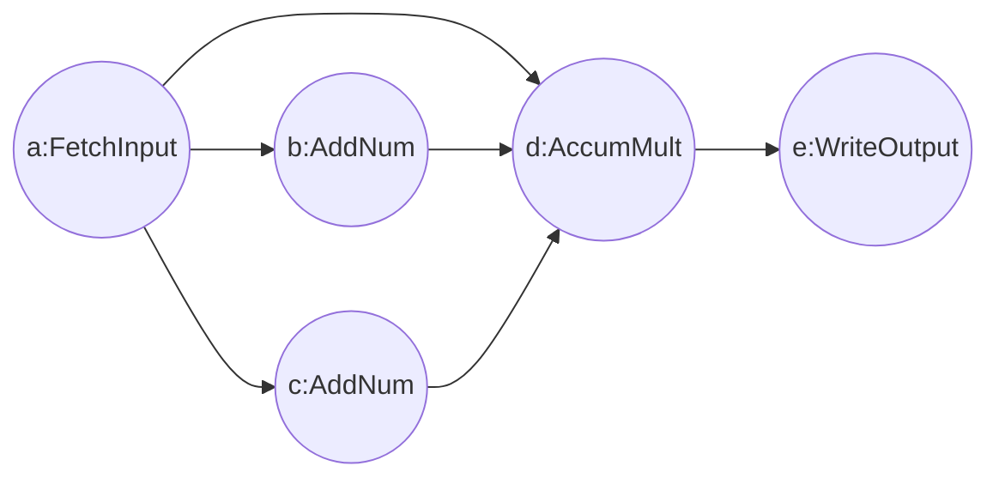

# 实现简单的数学计算
可以在这里体验图任务的生成：[taskflow demo](http://120.53.17.104:8000/)
## 主要功能
实现简单的计算功能，示例中的图结构如下，实现了以下的数学计算(m, n可配置)：
$$y=x(x+m)(x*n)$$


## 已实现算子
- FetchInput: 获取全局外部输入算子
- WriteOutput: 最终的结果输出算子
- AddNum: 对输入加上某个数字之后输出。其中数字需要在config里面定义(eg. num=10)
- MultNum: 对输入乘上某个数字之后输出。其中数字需要在config里面定义(eg. num=10)
- AccumNum: 上游算子的结果进行累计相乘之后输出。
- AccumAdd: 上游算子的结果进行累计相加之后输出。
- Add: 此算子需要上游有且仅有两个依赖。将上游两个算子的数据相加之后输出。
- Mult: 此算子需要上游有且仅有两个依赖。将上游两个算子的数据相乘之后输出
编译算子:

```shell
bazel build //:math_op
```

## 运行方法
将编译好的算子复制到你的算子目录下：

```shell
mv bazel-bin/libmath_op.so /your_project/ops
```

修改main文件(line:23-25)的json地址和算子地址为你的对应地址：

```c++
 // json文件地址，这里修改到你的json地址
 std::string json_path = "/home/lion/taskflow/test/math_test/data/test_json";
 // 算子目录，这里修改到你的算子目录
 std::string script_path = "/home/lion/taskflow/test/math_test/ops";
```

运行计算

```shell
bazel run //:math_test
```

得到以下结果：

```shell
[2023-01-07 14:47:53.800] [info] [latency_guard.h:27] run graph cost 0.059042 ms.
[2023-01-07 14:47:53.800] [info] [main.cpp:35] 7 input is:92
[2023-01-07 14:47:53.800] [info] [main.cpp:48] last res:1608160
[2023-01-07 14:47:53.800] [info] [latency_guard.h:27] run graph cost 0.049916 ms.
[2023-01-07 14:47:53.800] [info] [main.cpp:35] 8 input is:49
[2023-01-07 14:47:53.800] [info] [main.cpp:48] last res:249704
[2023-01-07 14:47:53.800] [info] [latency_guard.h:27] run graph cost 0.025833 ms.
[2023-01-07 14:47:53.800] [info] [main.cpp:35] 9 input is:21
[2023-01-07 14:47:53.800] [info] [main.cpp:48] last res:21168
[2023-01-07 14:47:53.800] [info] [latency_guard.h:27] run graph cost 0.065833 ms.
```

