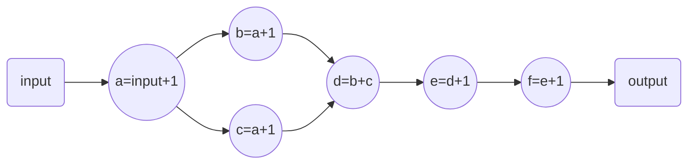

# 实现简单的数学计算

实现图计算



编译算子:

```shell
bazel build //:math_op
```

将编译好的算子复制到你的算子目录下：

```shell
mv bazel-bin/libmath_op.so /your_project/ops
```

修改main文件(line:23-25)的json地址和算子地址为你的对应地址：

```c++
 // json文件地址，这里修改到你的json地址
 std::string json_path = "/home/lion/taskflow/test/math_test/data/test_json";
 // 算子目录，这里修改到你的算子目录
 std::string script_path = "/home/lion/taskflow/test/math_test/ops";
```

运行计算

```shell
bazel run //:math_test
```

得到以下结果：

```shell
[2022-12-08 01:05:40.012] [info] [math_op.cpp:26] config of a is c:2
[2022-12-08 01:05:40.012] [info] [math_op.cpp:26] config of a is a:1
[2022-12-08 01:05:40.012] [info] [latency_guard.h:27] cost cost 0.023334 ms.
[2022-12-08 01:05:40.012] [info] [main.cpp:48] last res:6
```

